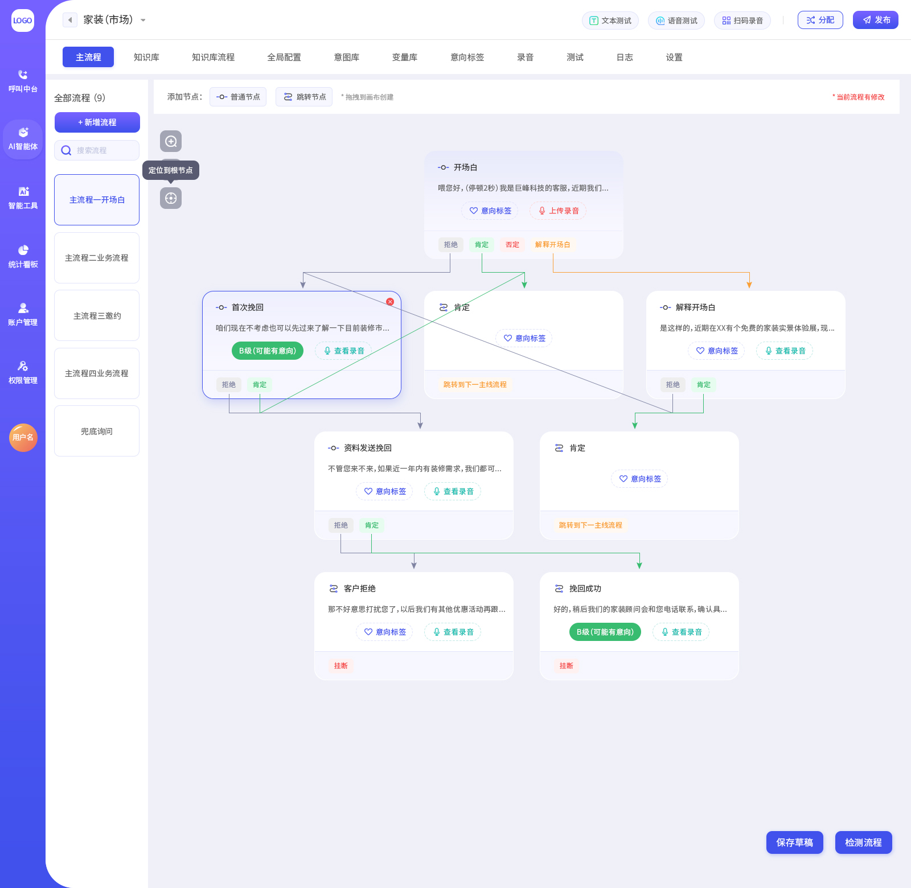

[](LICENSE)
# AI Customer Service Agent Generator

**This service is available at [telrobot.qutuitech.cn](https://telrobot.qutuitech.cn/). If you would like to give it a try, please contact me via [email](mailto:lituokobe@gmail.com).**

A highly configurable **AI-powered customer service agent engine** with a visual workflow designer.
It allows business users to quickly build LLM-powered customer service agents using node-based
conversation flows and conditional logic.

The system can identify user intent in real time and generate accurate responses, making it suitable for:
- Customer support
- Business promotion
- Telephone sales and outreach
- Intelligent assistants



---

## ✨ Key Features

- **Visual Conversation Flow Design**  
  Design dialogue logic using intuitive **nodes** and **conditional edges** to match real business scenarios.

- **Multiple Intent Recognition Strategies**  
  Combine keyword matching, semantic similarity (NLP), and LLM reasoning for accurate intent detection.

- **Dual Intent System**  
  Support both **node-specific intent libraries** and a **global knowledge base**.

- **Low-Latency Real-Time Response**  
  Optimized for telephone and real-time conversation environments.

- **Flexible Priority Strategies**  
  Resolve intent conflicts using configurable priority policies.

- **High Concurrency Support**  
  Multiple users and sessions can interact with the system simultaneously without conflict.

## 🧠 Conversation Model

The agent’s conversation logic is composed of:

- **Base Nodes**  
  Send preconfigured replies and detect customer intentions in real time.

- **Transfer Nodes**  
  Reply to the user and transfer the conversation to another conversation flow.

- **Edges (Conditional Transitions)**  
  Define how conversations move between nodes based on detected intentions.

A well-designed flow enables the agent to efficiently complete customer service tasks and business objectives.

---

## 🔍 Intent Recognition Mechanism

Each intent can be configured with one or more of the following detection strategies:

### 1. Keyword Matching (Always Enabled)
- Based on the **Aho–Corasick algorithm**
- Supports regular expressions
- Extremely fast and suitable for explicit, simple intents

### 2. NLP Semantic Similarity (Optional)
- Matches user input with predefined utterances using vector similarity
- Configurable similarity threshold (default: `0.8`)
- Higher thresholds increase precision but reduce recall

### 3. LLM-Based Reasoning (Optional)
- Uses large language models to understand complex or ambiguous contexts
- Configurable minimum trigger length (default: `3` characters)
- Supports configurable conversation context depth for better accuracy

---

## 🗂️ Intent System Design

### 1. Node-Specific Intent Library
- Intents used only within a specific node
- Designed for targeted decision-making  
  (e.g. determining whether a user is interested or not in a commercial event)

### 2. Global Knowledge Base
- Intents that may be triggered at **any point** in the conversation
- Suitable for general or out-of-flow questions such as:
  - “What is your name?”
  - “Where is the event located?”

### 3. Intent Priority Strategy
When both node-specific intents and global knowledge intents are evaluated, one of the following strategies can be selected:

- **Node Intent First**
- **Knowledge Base First**
- **Smart Priority (Automatic)**

### 4. Flexible Controls
- Disable specific knowledge intents for selected nodes
- Configure maximum match count for each knowledge intent (default: unlimited)

---

## 🏗️ System Architecture

### Core Models

| Component                    | Model                                                                                                                                                                                                                  | Description                                     |
|------------------------------|------------------------------------------------------------------------------------------------------------------------------------------------------------------------------------------------------------------------|-------------------------------------------------|
| **Embedding Model**          | [BGE-Large-Zh-v1.5](https://huggingface.co/BAAI/bge-large-zh-v1.5)                                                                                                                                                     | Semantic embedding and similarity computation   |
| **LLM (API-based)**          | - [Qwen-max](https://qwen-ai.chat/models/qwen3-max/) (most accurate)<br/>- [Qwen-flash](https://qwen-ai.chat/models/qwen-flash/) (fastest)<br/>- [Qwen-turbo](https://qwen-ai.chat/models/qwen-turbo/) (most balanced) | Intent classifying with complex reasoning       |
| **LLM (Privately-deployed)** | - [Qwen3-4B Fined-tuend with LoRA](https://github.com/lituokobe/Qwen3-Fine-Tuning) <br/>(Production-ready in speed, latency, cost and security)                                                                        | Intent classifying with complex reasoning       |


### Core Components

| Module                | Technology                                                                                                                                                               | Description                       |
|-----------------------|--------------------------------------------------------------------------------------------------------------------------------------------------------------------------|-----------------------------------|
| **Workflow Engine**   | [LangGraph + LangChain](https://www.langchain.com/langgraph)                                                                                                             | Conversation flow orchestration   |
| **Vector Store**      | [Milvus Standalone](https://milvus.io/)                                                                                                                                  | High-performance vector retrieval |
| **State Storage**     | [Redis](https://redis.io/)                                                                                                                                               | Session and state management      |
| **API Services**      | [Flask](https://flask.palletsprojects.com/en/stable/) + [Quart](https://quart.palletsprojects.com/en/latest/) + [Hypercorn](https://hypercorn.readthedocs.io/en/latest/) | RESTful API layer                 |
| **Deployment**        | [Docker + Docker Compose](https://www.docker.com/)                                                                                                                       | Containerized deployment          |

---

## 🚀 Quick Start

### 1. Environment Requirements
- **Python**: 3.8+ (Recommended: 3.11)
- **Dependencies**: See `requirements.txt`

```bash
# Clone repository
git clone https://github.com/lituokobe/AI-CS-Agent/
cd customer-service-bot

# Install dependencies
pip install -r requirements.txt
```

### 2. API Key Configuration

1. Register for an Alibaba Cloud Bailian account
2. Rename `.env.example` to `.env`
3. Configure your API key:

```bash
ALI_API_KEY=your_ali_api_key
```

### 3. Project Data Structure

Conversation logic is fully defined via the GUI at runtime.
Sample test data is provided in the `./data/` directory.

Example: `simulated_data.py`

- `agent_data` – Agent-level configuration (NLP, LLM, priority strategies)
- `chatflow_design` – Conversation flow definitions
- `intentions` – Node intent library definitions
- `knowledge` – Global knowledge base intents
- `knowledge_main_flow` – Conversation flows triggered by knowledge hits
- `global_configs` – Fallback and default behaviors

### 4. Run a Test

```bash
python run_chatflow.py
```

---

## 📡 API Documentation

### Gateway Layer (Port: 5001)
Implemented in `ai_gateway_service.py`

- `GET /gateway/health` – Health check
- `POST /gateway/model/start` – Start a conversation model
- `POST /gateway/conversation` – Chat with the agent

### Model Service Layer (Port: 5002)
Implemented in `ai_service.py`

- `GET /health`
- `POST /model/initialize`
- `POST /model/extend`
- `POST /model/generate`
- `POST /model/destroy`
- `GET /model/status`
- `POST /model/cleanup`
- `POST /model/persistence/backup`
- `GET /model/persistence/status`

---

## 📄 License

This project is licensed under the **Apache License 2.0**.